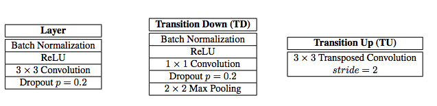
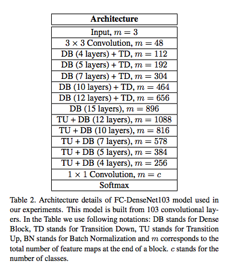
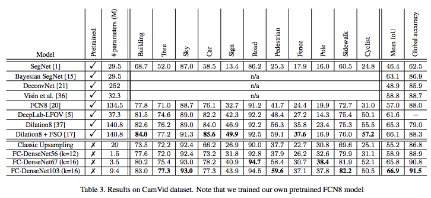
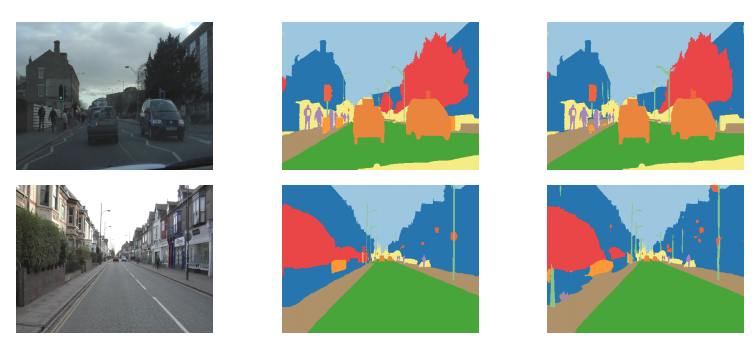
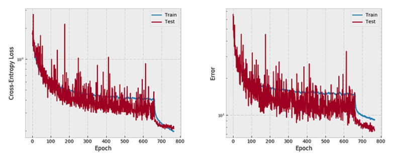
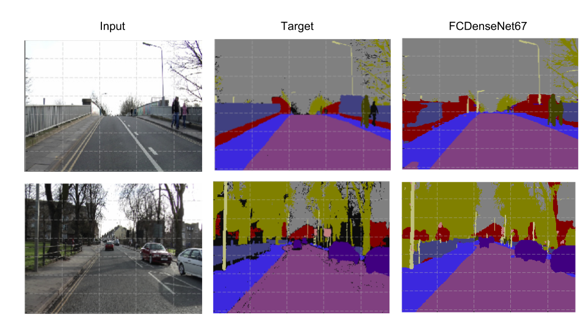

# One Hundred Layers Tiramisu
PyTorch implementation of [The One Hundred Layers Tiramisu: Fully Convolutional DenseNets for Semantic Segmentation](https://arxiv.org/pdf/1611.09326).

Tiramisu (FCDenseNet) combines the DensetNet and UNet architectures for a high performance semantic segmentation model. In this repository we attempt to replicate the authors' results on the CamVid dataset.

## Setup

Requires Anaconda for Python3 installed.

```
conda create --name tiramisu python=3.6
source activate tiramisu
conda install pytorch torchvision -c pytorch
```

## Datasets

These links are old, data here is missing or still in video format. There are newer alternatives like PASAL VOC and MSCOCO, but the authors don’t provide benchmarks for these.

* [CamVid](http://mi.eng.cam.ac.uk/research/projects/VideoRec/CamVid/), [Download](https://github.com/mostafaizz/camvid), [Alternative](https://github.com/alexgkendall/SegNet-Tutorial/tree/master/CamVid), [Pytorch DataLoader](https://github.com/pytorch/vision/pull/90)
* [Gatech](http://www.cc.gatech.edu/cpl/projects/videogeometriccontext/)

**Camvid**

* TrainingSet = 367 frames
* ValidationSet = 101 frames
* TestSet = 233 frames
* Images of resolution 360x480
* Images "Cropped" to 224x224 for training --- center crop?
* FullRes images used for finetuning
* NumberOfClasses = 11 (output)
* BatchSize = 3

## Architecture

Tiramisu adopts the UNet architecture with downsample, bottleneck, and upsample paths with skip connections. It replaces convolution and max pooling blocks with Dense blocks from the DenseNet architecture. DenseNet include residual connections like ResNet except it concatenates, rather than sums, prior feature maps.


**Layers**



**FCDenseNet103**



## Authors' Results





## Our Results

**FCDenseNet67**

I trained for 766 epochs with 50 epochs fine-tuning. The authors mention "global accuracy" of 90.8 for FC-DenseNet67 on Camvid, compared to my 86.8.

| Dataset     | Loss  | Accuracy |
| ----------- |:-----:| --------:|
| Validation  | .209  | 92.5     |
| Testset     | .435  | 86.8     |



**FCDenseNet103**

| Dataset     | Loss  | Accuracy |
| ----------- |:-----:| --------:|
| Validation  | .209  | 92.5     |
| Testset     | .435  | 86.8     |


**Predictions**



## Training

**Hyperparameters**

* WeightInitialization = HeUniform
* Optimizer = RMSProp
* LR = .001 with exponential decay of 0.995 after each epoch
* Data Augmentation = Random Crops, Vertical Flips
* ValidationSet with early stopping based on IoU or MeanAccuracy with patience of 100 (50 during finetuning)
* WeightDecay = .0001
* Finetune with full-size images, LR = .0001
* Dropout = 0.2
* BatchNorm "we use current batch stats at training, validation, and test time"

## References and Links

* [Project Thread](http://forums.fast.ai/t/one-hundred-layers-tiramisu/2266)
* [Author's Implementation](https://github.com/SimJeg/FC-DenseNet)
* https://github.com/bamos/densenet.pytorch
* https://github.com/liuzhuang13/DenseNet
